# Manual Elasticsearch

## Requisitos

* Docker version 18.06.0 y docker-compose 1.26.0 o superior
* 1.5 GB de RAM
* Una máquina Linux sobre la que montar el Elastic y el filebeat

## Instalación

Descargamos la versión 8.4.3 de Elasticsearch en github y nos ubicamos dentro del directorio.

    git clone https://github.com/deviantony/docker-elk.git
    cd docker-elk

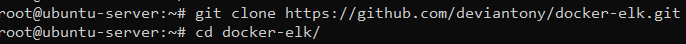

Levantamos el compose y esperamos a que todo arranque.

    docker-compose up -d

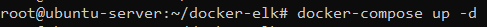

En cuanto todo esté levantado ya podremos acceder por el navegador al kibana. http://IP_MAQUINA:5601

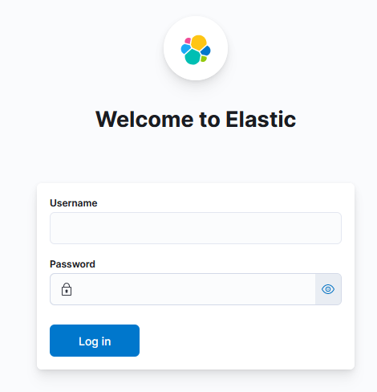

Las credenciales por defecto son:

    Username: elastic
    Password: changeme

Una vez validadas las credenciales, pinchamos en "Explore on my own" y ya podemos crear nuestras visualizaciones.

## Agentes

El agente que vamos a utilizar es filebeat, uno de los muchos beats que están integrados con ELK y que sirve para recoger los logs de los servicios que queramos.

### Filebeat

Para instalar filebeat en nuestra máquina Linux (en mi caso Ubuntu 20.04) ejecutaremos:

    wget -qO - https://artifacts.elastic.co/GPG-KEY-elasticsearch | sudo apt-key add -
    sudo apt-get install apt-transport-https
    echo "deb https://artifacts.elastic.co/packages/8.x/apt stable main" | sudo tee -a /etc/apt/sources.list.d/elastic-8.x.list

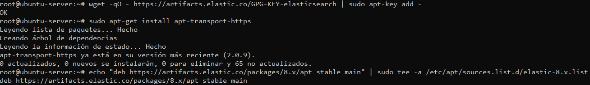

Para poder monitorizar el servicio de apache, habilitamos el módulo de apache para filebeat.

    sudo filebeat modules enable apache

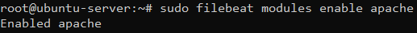

Antes de levantar el servicio tendremos que especificar un input de donde leer los logs y un output donde se enviarán los logs. Para ello, dentro del archivo filebeat.yml

    sudo nano /etc/filebeat/filebeat.yml

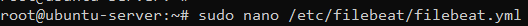

Activamos el input de tipo filestream.

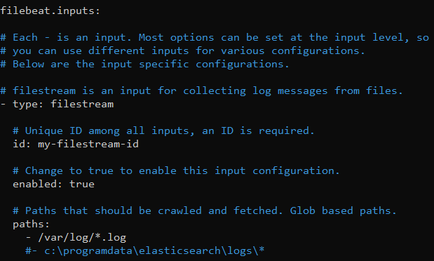

Configuramos el output de logstash, comentando el de Elasticsearch, descomentando el de logstash e indicando la dirección del mismo.

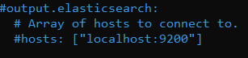
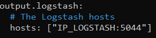

Una vez hemos configurado el servicio lo habilitamos y arrancamos.

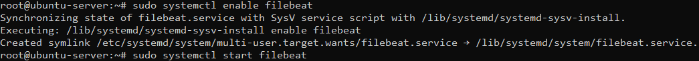

## Visualización en Kibana

Necesitaremos añadir la integración con apache de Elasticsearch. Para ello nos situamos en el menú de inicio "Home" y pinchamos en "Add integrations".

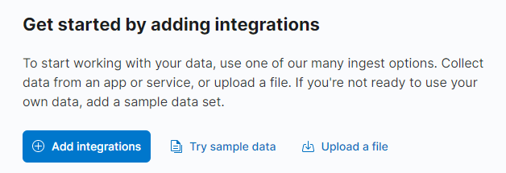

En el filtro escribimos apache y elegimos "Apache HTTP Server".

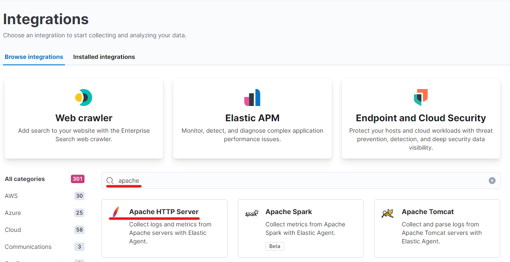

Pinchamos en "Add Apache HTTP Server".

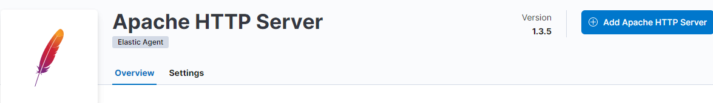

Después de añadirlo, nos preguntará si queremos añadir el Elastic agent y diremos que sí.

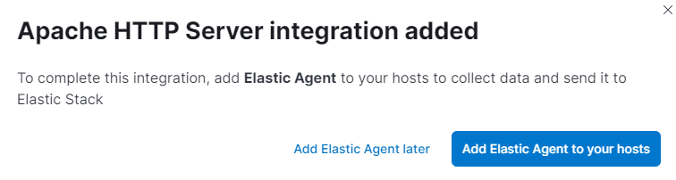

Para añadir el agente seguiremos las instrucciones que aparecen en "Run standalone".

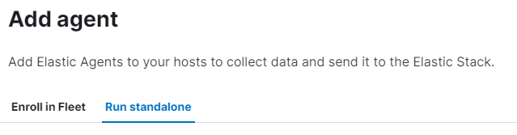

Ejecutaremos lo siguientes comandos.

    curl -L -O https://artifacts.elastic.co/downloads/beats/elastic-agent/elastic-agent-8.4.3-linux-x86_64.tar.gz
    tar xzvf elastic-agent-8.4.3-linux-x86_64.tar.gz
    cd elastic-agent-8.4.3-linux-x86_64
    sudo ./elastic-agent install

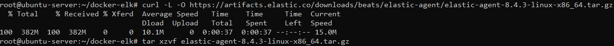
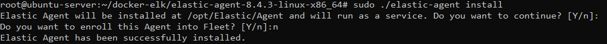

Coiamos el contenido de la configuración y la pegamos en el archivo elastic-agent.yml.

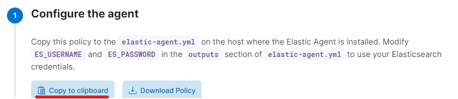

    nano /opt/Elastic/Agent/elastic-agent.yml

Ponemos las credenciales del usuario que estamos usando (en mi caso elastic y changeme) y guardamos el archivo.

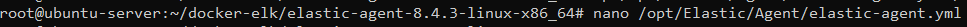
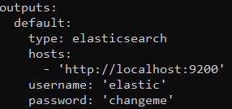

Ahora reiniciamos el servicio para que coja los cambios realizados.

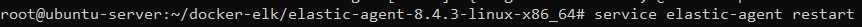

Para visualizar datos en kibana tendremos primero que crear el data view de uno de los índices recibidos a través de los agentes. Deberemos ir a "Stack Management" > "Kibana" > "Data Views" > "Create data view". Asignamos un nombre al data view y escribimos el index pattern correspondiente.

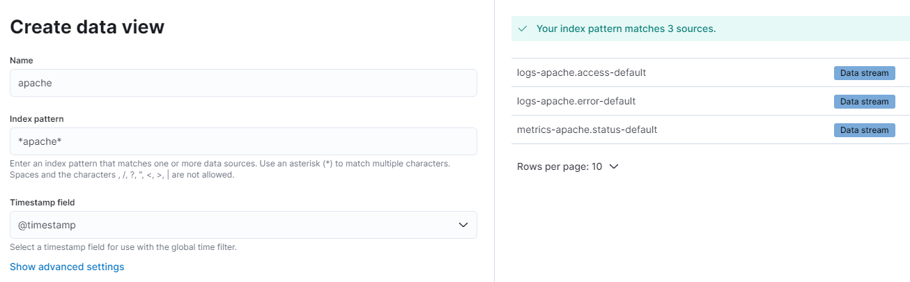

Nos situamos en el apartado de dashboards y elegimos el nuestro.

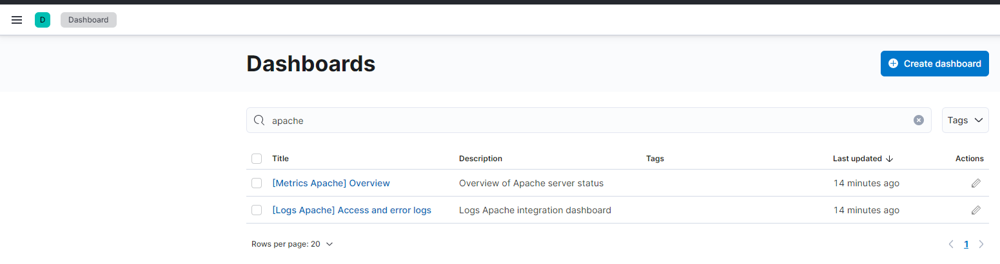

Ya podemos visualizar los gráficos recogidos para apache, pudiendo modificar los datos de interes como nosotros queramos.

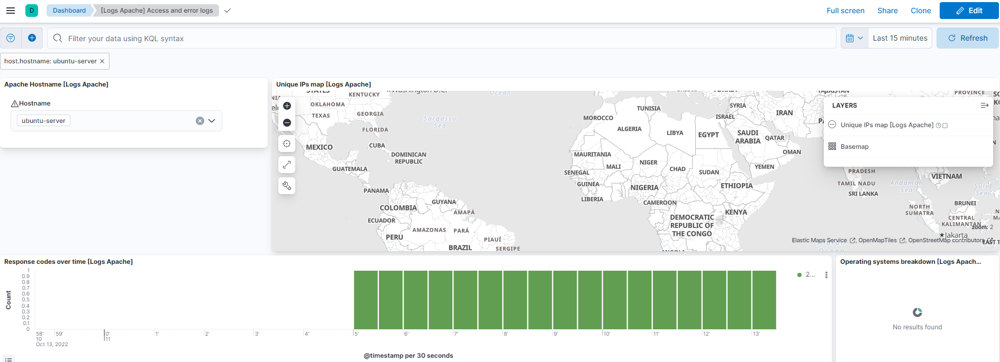